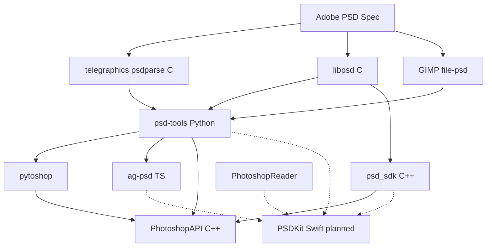

# PSD 读写生态全景（跨语言参考调研）

> 目的：在写 Swift 代码之前，先搞清楚「业界已经做了什么、各自边界在哪、我们首版要对齐哪几条路径」。  
> 本文档**不限于 Swift**；按语言与「读 / 写 / 图层编辑」能力分类。

**权威规范（所有实现的共同上位）**  
[Adobe Photoshop File Formats Specification](https://www.adobe.com/devnet-apps/photoshop/fileformatashtml/)

---

## 1. 能力维度说明

评价任一库时，建议用下面同一套维度，避免「能读」和「能写可编辑 PSD」混为一谈：

| 维度 | 含义 |
|------|------|
| **R** | 读取 PSD/PSB |
| **W** | 写出 PSD/PSB（不仅是导出 PNG） |
| **L** | 图层结构（列表 / 树 / 组） |
| **P** | 像素层通道数据（RLE/Raw 解压、平面通道） |
| **E** | 图层编辑（增删改、改名、opacity、顺序） |
| **FX** | 图层样式 / 效果（`lfx2` 等）解析或合成 |
| **TXT** | 文字图层可编辑 |
| **ADJ** | 调整图层 |
| **16/32** | 16/32 bit 或 PSB |
| **许可** | 开源协议 / 商业 |

**PSDKit v1 目标**：R + W + L + P + E（仅位图图层），**不**做 FX/TXT/ADJ 的解析编辑（未知块透传）。

---

## 2. 总览对照表

| 项目 | 语言 | R | W | L | P | E | FX | 维护 | Stars≈ | 许可 | 与 v1 关系 |
|------|------|---|---|---|---|---|---|------|--------|------|------------|
| [psd-tools](https://github.com/psd-tools/psd-tools) | Python | ✓ | ✓ | ✓ | ✓ | △ | △ | **活跃** | 1.4k | MIT | **首选逻辑对标** |
| [PhotoshopAPI](https://github.com/EmilDohne/PhotoshopAPI) | C++/Py | ✓ | ✓ | ✓ | ✓ | ✓ | △ | 活跃 | 330 | BSD-3 | 全功能参考 / 回归 |
| [psd_sdk](https://github.com/MolecularMatters/psd_sdk) | C++ | ✓ | △ | ✓ | ✓ | △ | △ | 较慢 | 655 | BSD-2 | **RLE/平面通道算法** |
| [ag-psd](https://github.com/Agamnentzar/ag-psd) | TS/JS | ✓ | ✓ | ✓ | ✓ | ✳ | ✳ | 活跃 | 650 | MIT | **读写闭环 + fixture** |
| [pytoshop](https://github.com/mdboom/pytoshop) | Python | ✓ | ✓ | ✓ | ✓ | ✳ | ✗ | 停滞 | 126 | BSD | **写 PSD 的早期参考** |
| [psd](https://github.com/chinedufn/psd) | Rust | ✓ | ✗ | ✓ | ✓ | ✗ | ✗ | 慢 | 280 | Apache-2 | 读 + flatten 参考 |
| [rawpsd](https://docs.rs/rawpsd) | Rust | ✓ | ✗ | ✓ | △ | ✗ | ✗ | 小众 | — | — | **低层透传思路** |
| [oov/psd](https://github.com/oov/psd) | Go | ✓ | ✗ | ✓ | ✓ | ✗ | ✗ | 有更新 | 157 | — | Go 层结构参考 |
| [gopsd](https://github.com/solovev/gopsd) | Go | ✓ | ✗ | ✓ | ✓ | ✗ | ✗ | 停更 | 60 | — | 简单示例 |
| [qtpsd](https://github.com/signal-slot/qtpsd) | C++/Qt | ✓ | △ | ✓ | ✓ | △ | ✓ | 活跃 | — | — | 渲染/导出架构参考 |
| [GIMP file-psd](https://github.com/GNOME/gimp/tree/master/plug-ins/file-psd) | C | ✓ | ✓ | ✓ | ✓ | △ | △ | 活跃 | — | GPL | **真实互操作**参考 |
| [libpsd](https://github.com/TheNicker/libpsd) | C | ✓ | △ | ✓ | ✓ | △ | ✓ | 分叉 | — | — | 老代码，效果混合 |
| [stb_image](https://github.com/nothings/stb) | C | △ | ✗ | ✗ | △ | ✗ | ✗ | 活跃 | — | MIT/PD | 仅合成图，非库 |
| [PhotoshopReader](https://github.com/hughbe/PhotoshopReader) | Swift | ✓ | ✗ | ✓ | △ | ✗ | ✗ | 停更 | 16 | — | Swift 分段命名 |
| [featherJ/psd.swift](https://github.com/featherJ/psd.swift) | Swift | ✓ | ✗ | △ | △ | ✗ | ✗ | 停更 | 13 | — | 不推荐 |
| [Aspose.PSD](https://github.com/aspose-psd) | Java/.NET | ✓ | ✓ | ✓ | ✓ | ✓ | ✓ | 商业 | — | 商业 | 功能上限样本 |
| [JPSD](https://github.com/Minecraftian14/JPSD) | Java | ✓ | ✓ | △ | ✓ | ✳ | ✗ | 小众 | — | — | 多图层**写**示例 |
| [ImageMagick](https://imagemagick.org) | C | △ | △ | △ | △ | △ | ✗ | 活跃 | — | Apache-2 | **不适合**作核心对标 |
| npm [psd](https://www.npmjs.com/package/psd) | JS | ✓ | ✗ | ✓ | △ | ✗ | ✗ | 停更 | — | MIT | 树遍历，难写回 |

图例：✓ 成熟 · △ 部分 · ✳ 有限/实验 · ✗ 不支持

---

## 3. 我们在干什么（用参考库反推）

PSDKit 不是「再做一个 Photoshop」，而是：

```text
┌─────────────────────────────────────────────────────────┐
│  目标：8-bit RGB(A) 位图图层的 PSD 读 / 写 / 简单编辑      │
├─────────────────────────────────────────────────────────┤
│  必须做对：FileHeader, LayerInfo, Channel RLE/Raw,       │
│            LayerRecord 元数据, 图层顺序, 复合 Image Data   │
│  必须保留：未知 Image Resources / Tagged Blocks 字节       │
│  明确不做：效果合成、文字引擎、调整图层、16/32、PSB       │
└─────────────────────────────────────────────────────────┘
```

对应到参考库的分工：

| 我们要实现的子问题 | 第一参考 | 第二参考 | 第三参考 |
|-------------------|----------|----------|----------|
| 二进制分段与 LayerRecord | psd-tools `psd/` | PhotoshopReader | ag-psd `psdReader.ts` |
| PackBits RLE | psd-tools `compression/rle.py` | psd_sdk `PsdDecompressRle` | GIMP `psd-load.c` |
| 平面 → RGBA | psd_sdk interleave | psd Rust `layer.rgba()` | psd-tools composite |
| 图层树（Section Divider） | psd-tools `api/layers` | ag-psd `children` | oov/psd 嵌套 `Layer` |
| 从零写 PSD | pytoshop | psd-tools `PSDImage.new/save` | JPSD `writeTo` |
| 增删图层 | psd-tools `group.append/remove` | PhotoshopAPI `remove_layer` | ag-psd 重组 `children` |
| 写后 PS 能打开 | ag-psd 测试 psd | GIMP 导出 | 手工 PS 清单 |
| 复杂文件行为（负例） | PhotoshopAPI | Aspose 文档 | GIMP 导入日志 |

---

## 4. 分语言详解

### 4.1 Python

#### psd-tools（**核心对标**）

- 仓库：https://github.com/psd-tools/psd-tools  
- 文档：https://psd-tools.readthedocs.io/

**架构**（最值得 Swift 复制的模式）：

```text
psd_tools.psd.*     ← 与 Adobe spec 1:1 的二进制模型（header, layer_and_mask, …）
psd_tools.api.*     ← PSDImage / PixelLayer / Group，图层树与编辑
psd_tools.compression.* ← RLE 等
```

**与 v1 直接相关的 API**（官方文档 [Usage](https://psd-tools.readthedocs.io/en/stable/usage.html)）：

```python
psd = PSDImage.new(mode='RGB', size=(640, 480), depth=8)
layer = psd.create_pixel_layer(pil_image, name="Layer 1", ...)
group.append(layer)
psd.save('out.psd')
```

**局限**：合成/效果/文字等不完整；复杂文件需落到 `psd_tools.psd` 低层。

**建议阅读的源文件**：

- `src/psd_tools/psd/header.py`
- `src/psd_tools/psd/layer_and_mask.py`
- `src/psd_tools/compression/rle.py`
- `src/psd_tools/api/psd_image.py`
- `src/psd_tools/api/layers.py`

---

#### pytoshop（写路径历史参考）

- 仓库：https://github.com/mdboom/pytoshop  
- 文档：https://pytoshop.readthedocs.io/

作者明确参考了 **Adobe spec + psd-tools 源码**。2022 年后维护减弱，但「**用代码构建 PSD 并写盘**」的思路仍清晰，适合在对照 psd-tools 写路径时交叉验证字段顺序。

---

#### PhotoshopAPI（Python 绑定）

- 仓库：https://github.com/EmilDohne/PhotoshopAPI  
- PyPI：`pip install PhotoshopAPI`

C++20 实现 + Python。`LayeredFile.read` / `remove_layer` / `write` 代表「图层为一等公民」的产品方向。  
**用途**：生成复杂 PSD 做负向测试；**不**建议 v1 嵌入依赖。

---

### 4.2 C / C++

#### psd_sdk（**算法对标**）

- 仓库：https://github.com/MolecularMatters/psd_sdk  
- 产品页：https://molecular-matters.com/products_psd_sdk.html

特点：无 STL、两段式 parse/extract、RLE、导出器模块 `PsdExport*`。  
模块图见仓库 `CMakeLists.txt`（Parser / ImageUtil / Exporter / Sections）。

---

#### libpsd（遗留完整解码）

- 分叉示例：https://github.com/TheNicker/libpsd  
- 原版：https://sourceforge.net/projects/libpsd/

声称覆盖 effect、adjustment 等，可 **blend**。代码年代久，但 psd-tools 作者曾注明从 libpsd、GIMP、telegraphics psdparse 学习。  
**用途**：遇到冷门 tagged block 时的对照；**不建议**整体移植。

---

#### stb_image

- https://github.com/nothings/stb `stb_image.h`

PSD 在列表中，但本质是**读入合成后的 raster**，不是图层编辑器。  
**结论**：不能作为 PSDKit 架构参考，最多验证合并图像素。

---

#### telegraphics psdparse（C，历史）

- http://telegraphics.com.au/svn/psdparse/trunk/

psd-tools README 致谢的早期 C 解析器，含 zip-with-prediction 等案例。遇到压缩类型 2/3 时可查注释。

---

### 4.3 JavaScript / TypeScript

#### ag-psd（**读写闭环**）

- 仓库：https://github.com/Agamnentzar/ag-psd  
- npm：https://www.npmjs.com/package/ag-psd

**优点**：

- `readPsd` / `writePsd` / `writePsdBuffer` API 简单
- 测试目录 `test/psd`、`test/write` 大量 fixture
- 明确文档：改像素要改 `layer.canvas`；改文字要 `invalidateTextLayers`

**局限**（与 v1 一致的部分）：

- 不自动重绘矢量/文字
- 图层效果不合成

**示例（写多图层）** — 见 [Atomic Object 文章](https://spin.atomicobject.com/parsing-psd-files-ag-psd/)：

```typescript
const newPsd: Psd = { ...psd, children, canvas };
const buffer = writePsdBuffer(newPsd);
```

---

#### npm `psd`（meltingice）

- https://www.npmjs.com/package/psd

只读、树结构 `psd.tree()`，**写回 PSD 困难**（Stack Overflow 上大量「替换智能对象失败」）。  
**结论**：仅作读结构参考，不作为写路径对标。

---

### 4.4 Rust

#### psd（chinedufn）

- 仓库：https://github.com/chinedufn/psd  
- 文档：https://docs.rs/psd

**优点**：API 干净，`layer.rgba()`、`flatten_layers_rgba`、按通道报告 compression。  
**缺点**：**无写**；维护节奏慢。

**适合 PSDKit**：读路径单元测试 golden（Rust 测完导出 bytes，Swift 读）。

---

#### rawpsd

- 文档：https://docs.rs/rawpsd

哲学：**最小意见** — `parse_layer_records` 返回接近文件的 struct，PackBits 解压但不解释效果。  
**适合 PSDKit**：设计「未知 Tagged Block 透传」时的理念参考。

---

### 4.5 Go

#### oov/psd（推荐）

- 仓库：https://github.com/oov/psd

`Layer` 含 `Channel map[int]Channel`、`AdditionalLayerInfo`、`SectionDividerSetting`、**嵌套** `Layer []Layer`。  
读图层 PNG 示例完整；**不写 PSD**；**不做混合合成**。

**适合 PSDKit**：`layer.go` 字段布局与 Section Divider 处理。

---

#### solovev/gopsd

- 仓库：https://github.com/solovev/gopsd

更老的解析器，示例 `doc.Layers` + `GetImage()`。维护停滞，优先级低于 oov/psd。

---

### 4.6 Java / .NET（商业 + 开源）

#### Aspose.PSD（Java / .NET）

- Java：https://github.com/aspose-psd/Aspose.PSD-for-Java  
- .NET：https://github.com/aspose-psd/Aspose.psd-for-.NET

**能力上限参考**：文字层、调整层、效果、蒙版、PSB、多色彩模式。  
**缺点**：商业许可、闭源核心。  
**用途**：确认「完整产品」应有哪些 API 形状；负向测试文件来源。

---

#### JPSD（开源 Java，写多层）

- 仓库：https://github.com/Minecraftian14/JPSD

示例直接 `LayerRecord` + `setCompositeImage` + `writeTo`，与 v1「手写 LayerInfo」非常接近：

```java
PSDDocument document = new PSDDocument(height, width);
document.setCompositeImage(composite);
layers.add(new LayerRecord(0, 0, "BackGround", layer1));
document.writeTo(destination);
```

**适合 PSDKit**：验证「最小写盘」字段是否齐全。

---

### 4.7 Qt / 工具链

#### QtPsd（signal-slot）

- 仓库：https://github.com/signal-slot/qtpsd

模块化：`PsdCore`（解析）→ `PsdGui`（QImage）→ `PsdWidget`（显示）→ `PsdExporter`。  
与 PSDKit 规划 **高度同构**（Core / Viewer / Export），可参考分层与 [similarity_report](https://github.com/signal-slot/qtpsd)（与 PS 视觉相似度）。

---

#### GIMP `plug-ins/file-psd`

- 路径：https://github.com/GNOME/gimp/tree/master/plug-ins/file-psd

| 文件 | 作用 |
|------|------|
| `psd-load.c` / `psd-save.c` | 加载/保存主流程 |
| `psd-layer-res-load.c` | 图层资源、`lfx2` 等 |
| `psd-util.c` | blend mode 与 GIMP mode 映射 |

**价值**：真实用户用 PS ↔ GIMP 互传的兼容性；写 PSD 时「Maximize Compatibility」复合层行为。

---

#### ImageMagick

- 讨论：https://github.com/ImageMagick/ImageMagick/discussions/3024

**结论**：

- 不能可靠编辑文字/调整层
- 多层写回常丢 metadata
- 仅适合栅格处理，**不是** PSD 结构库

**PSDKit 不应**以 ImageMagick 为主要参考。

---

### 4.8 Swift（现状）

| 库 | 结论 |
|----|------|
| PhotoshopReader | 只读、五段式 struct，**Swift 命名与分段**参考 |
| psd.swift | 过时，仅解析/渲染 demo |

写路径无对标，必须自建，并依赖跨语言参考。

---

## 5. 历史与衍生关系（便于「知道从哪来」）



psd-tools 作者在早期 README 中说明：此前方案（PIL psd、GIMP 插件、pypsd）各有缺陷，故重写并参考多家解析器。

---

## 6. 推荐的最小参考组合（实施 PSDKit v1 时）

避免「库太多不知看哪个」，建议 **固定 5 个**：

1. **psd-tools** — 日常开发对照（读/写/测）
2. **psd_sdk** — RLE、平面通道、性能思路
3. **ag-psd** — 写盘 fixture、Photoshop 打开性
4. **GIMP file-psd** — 互操作与 blend mode 映射
5. **JPSD 或 psd-tools `create_pixel_layer`** — 最小「新建多图层 PSD」样本

**辅助**：Rust `psd`（golden 像素）、oov/psd（Go 层 struct）、PhotoshopAPI（复杂负例）。

**不作为核心**：ImageMagick、npm `psd`、stb_image、featherJ/psd.swift。

---

## 7. 用参考库驱动测试（建议流程）

```text
1. 用 psd-tools 或 JPSD 生成 8-bit RGBA 多图层 fixture
2. 用 psd-tools CLI 导出每层 PNG + 打印 layer 元数据作为 golden
      psd-tools show foo.psd
      psd-tools export foo.psd[0] layer0.png
3. PSDKit 读取同一文件，断言层数、bounds、像素 hash
4. PSDKit 修改 name/opacity/增删层后写盘
5. 再用 psd-tools 读回比对
6. 可选：ag-psd readPsd 交叉验证
7. 手工：Photoshop 打开写盘文件
```

---

## 8. 延伸阅读

- [02-format-v1.md](./02-format-v1.md) — v1 二进制范围
- [01-references.md](./01-references.md) — 精简版对标与源文件映射（原 01 保留作速查）
- [04-api-design.md](./04-api-design.md) — 计划 Swift API
- [05-implementation-plan.md](./05-implementation-plan.md) — 分阶段任务
