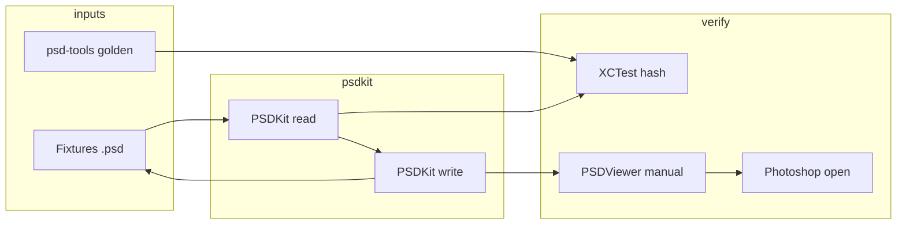

# 工程架构

## 1. 仓库总览

```
psdkit/
├── Package.swift                 # SwiftPM 根清单
├── Sources/
│   ├── PSDKit/                   # 核心库（无 UI 依赖）
│   └── PSDViewer/                # macOS 验证应用（SwiftUI）
├── Tests/
│   ├── PSDKitTests/              # 单元 +  golden 测试
│   └── Fixtures/                 # 测试用 .psd / 期望 hash
├── docs/                         # 设计文档（本目录）
└── Scripts/                      # 可选：用 psd-tools 生成 fixture
```

### 平台目标

| Target | 最低版本 | 说明 |
|--------|----------|------|
| PSDKit | macOS 13 / iOS 16 | 纯 Swift，可用 `swift-crypto` 做 hash |
| PSDViewer | macOS 14+ | SwiftUI + AppKit 桥接预览 |
| PSDKitTests | 同 PSDKit | `XCTest` |

首版以 **macOS** 为主验证平台（Viewer 与 Photoshop 联调方便）。

---

## 2. PSDKit 内部分层

```
┌──────────────────────────────────────────┐
│  Public API: PSDDocument, PixelLayer     │  ← 用户面向
├──────────────────────────────────────────┤
│  Composition: LayerTreeBuilder, Compositor│  ← 可选 v1.1
├──────────────────────────────────────────┤
│  Codec: PackBits, PlanarBuffer, Interleave│
├──────────────────────────────────────────┤
│  Binary: Reader, Writer, Endian, Padding │
├──────────────────────────────────────────┤
│  Model: FileHeader, LayerRecord, ...     │  ← 与 psd-tools.psd 对应
└──────────────────────────────────────────┘
```

**依赖规则**：上层可依赖下层；`Binary` 不依赖 `Public API`。

### 模块文件规划（建议）

```
Sources/PSDKit/
├── Public/
│   ├── PSDDocument.swift
│   ├── PSDDocument+IO.swift
│   ├── Layer.swift
│   └── Errors.swift
├── Model/
│   ├── FileHeader.swift
│   ├── LayerAndMask.swift
│   ├── LayerRecord.swift
│   ├── ChannelData.swift
│   ├── ImageResources.swift
│   └── TaggedBlock.swift
├── Binary/
│   ├── BinaryReader.swift
│   ├── BinaryWriter.swift
│   └── StringEncoding.swift
├── Codec/
│   ├── PackBitsCodec.swift
│   ├── Compression.swift
│   └── PlanarImage.swift
└── Internal/
    └── LayerTreeBuilder.swift
```

---

## 3. PSDViewer（验证应用）

### 职责

- 打开 `.psd`，展示图层列表与缩略图
- 选中图层：显示 bounds、opacity、blend mode（只读或简单编辑）
- **增**：从 PNG/TIFF 导入新像素层
- **删**：从文档移除图层
- **改**：重命名、显隐、不透明度、移动 bounds（整数像素）
- 保存 / 另存为，用于 Photoshop 交叉验证

### UI 结构（SwiftUI）

```
PSDViewerApp
├── DocumentGroup / FileDocument  → 绑定 PSDDocument
├── ContentView
│   ├── LayerListView             ← 左侧图层树
│   ├── CanvasView                ← 中间 CGImage 预览
│   └── InspectorView             ← 右侧属性
└── Services
    └── RenderService             ← Planar → CGImage
```

### 与核心库边界

- Viewer **不得** 包含 PSD 二进制解析逻辑
- 所有 IO 经 `PSDDocument.load(url:)` / `save(to:)`

---

## 4. 测试架构

### PSDKitTests

| 套件 | 内容 |
|------|------|
| `HeaderTests` | 合法/非法 signature、depth |
| `PackBitsTests` | 与 psd-tools 向量一致 |
| `LayerRecordTests` | 序列化 round-trip |
| `FixtureTests` | 读 `Tests/Fixtures/*.psd`，比对像素 hash |
| `WriteTests` | 内存构建 → 写临时文件 → 再读 |

### Fixtures

```
Tests/Fixtures/
├── minimal-rgb.psd          # 1 layer, raw
├── minimal-rgba-rle.psd     # RLE + alpha
├── multi-layer.psd          # 3 layers
└── golden/
    ├── minimal-rgb.sha256
    └── ...
```

可用 `Scripts/generate_fixtures.py`（调用 psd-tools）维护 golden。

### CI

- `swift test` on macOS runner
- 可选：lint `swift-format`

---

## 5. 与参考实现的验证关系



---

## 6. 非目标（首版架构层面）

- iOS 版 Viewer（可后续共享 PSDKit）
- 插件/Photoshop 面板
- 实时 GPU 混合模式全集
- C++/Python 绑定
